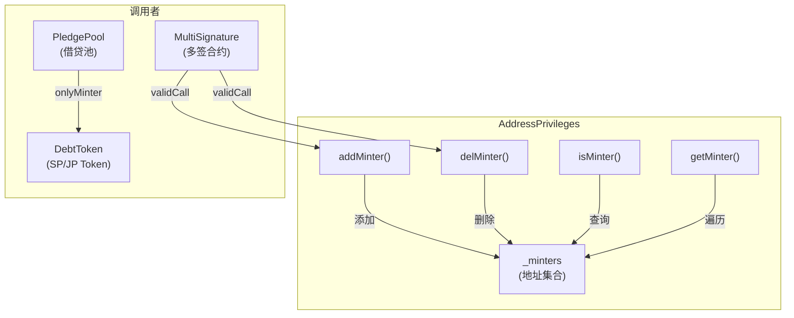
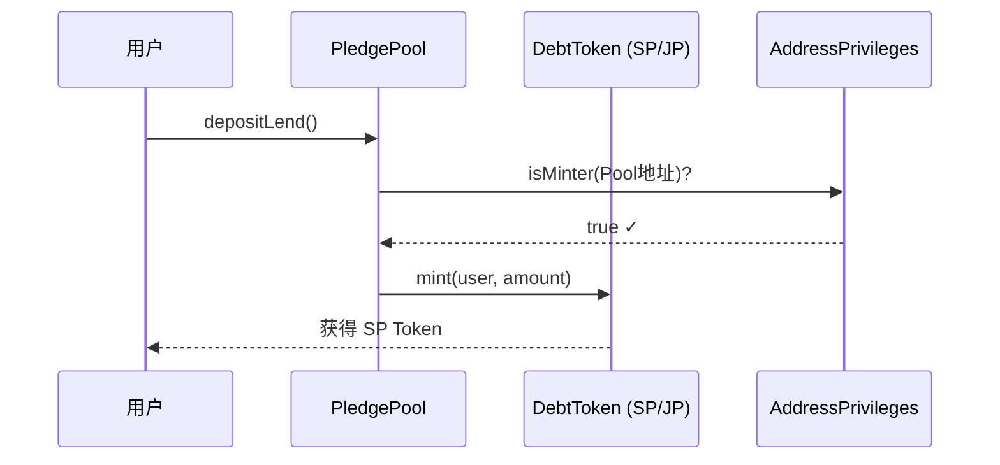
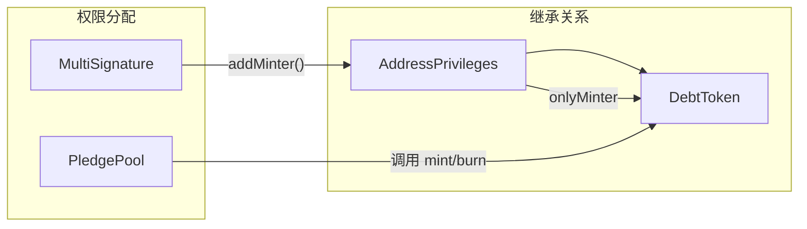
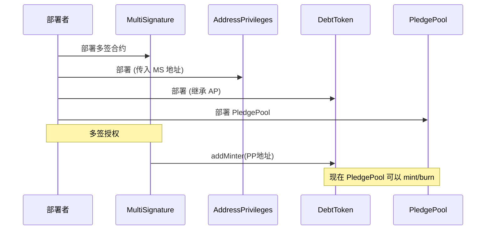

# AddressPrivileges 合约详解

> 权限管理合约，用于管理具有特定权限（如 Minter 铸造者）的地址集合。

---

## 合约概览

| 属性 | 值 |
|------|-----|
| 文件 | `contracts/pledge/AddressPrivileges.sol` |
| 继承 | `multiSignatureClient` |
| 依赖 | OpenZeppelin `EnumerableSet` |
| 作用 | 管理 Minter 权限地址 |

---

## 架构图



---

## 核心概念

### 什么是 Minter？

**Minter（铸造者）** 是被授权可以铸造（mint）或销毁（burn）代币的地址。

在 Pledge 项目中：
- **PledgePool 合约** 是 Minter
- 它可以在用户存款时 **mint SP Token / JP Token**
- 它可以在用户提款时 **burn SP Token / JP Token**



---

## 状态变量

```solidity
// 使用 EnumerableSet 管理地址集合
// 特点: 支持 O(1) 添加/删除/查询，且可遍历
EnumerableSet.AddressSet private _minters;
```

### 为什么用 EnumerableSet？

| 特性 | 普通 mapping | EnumerableSet |
|------|-------------|---------------|
| 查询 O(1) | ✓ | ✓ |
| 遍历所有元素 | ✗ | ✓ |
| 获取长度 | ✗ | ✓ |
| 按索引访问 | ✗ | ✓ |

---

## 函数详解

### 1. addMinter() - 添加铸造者

```solidity
function addMinter(address _addMinter) public validCall returns (bool)
```

| 参数 | 说明 |
|------|------|
| `_addMinter` | 要添加的 Minter 地址 |
| 返回值 | 添加成功返回 true |

**权限要求**: `validCall` - 需要多签授权

**使用场景**: 部署后，管理员将 PledgePool 地址添加为 Minter

### 2. delMinter() - 删除铸造者

```solidity
function delMinter(address _delMinter) public validCall returns (bool)
```

**权限要求**: `validCall` - 需要多签授权

**使用场景**: 紧急情况下移除某个合约的 Minter 权限

### 3. isMinter() - 检查是否为铸造者

```solidity
function isMinter(address account) public view returns (bool)
```

**使用场景**: DebtToken 在 mint/burn 前验证调用者权限

### 4. getMinterLength() - 获取铸造者数量

```solidity
function getMinterLength() public view returns (uint256)
```

### 5. getMinter() - 按索引获取铸造者

```solidity
function getMinter(uint256 _index) public view returns (address)
```

**使用场景**: 遍历所有 Minter 地址

---

## 修饰符

### onlyMinter

```solidity
modifier onlyMinter() {
    require(isMinter(msg.sender), "Token: caller is not the minter");
    _;
}
```

**作用**: 限制只有 Minter 才能调用某些函数

**使用位置**: `DebtToken.sol` 的 `mint()` 和 `burn()` 函数

---

## 与其他合约的关系



### 调用链示例

```
用户存款 → PledgePool.depositLend() 
        → DebtToken.mint(user, amount)
        → require(isMinter(msg.sender))  // 验证 PledgePool 是 Minter
        → 铸造 SP Token 给用户
```

---

## 安全考量

### 1. 多签保护

所有敏感操作（addMinter/delMinter）都需要多签授权：

```solidity
function addMinter(address _addMinter) public validCall returns (bool)
                                             ↑
                                     多签验证修饰符
```

### 2. 零地址检查

```solidity
require(_addMinter != address(0), "Token: _addMinter is the zero address");
```

### 3. 权限最小化

- 只有被明确添加的地址才有 Minter 权限
- 默认情况下，没有任何地址是 Minter

---

## 部署和初始化流程



---

## 总结

| 要点 | 说明 |
|------|------|
| **核心功能** | 管理谁有权铸造/销毁代币 |
| **保护机制** | 多签授权 + 零地址检查 |
| **主要用户** | PledgePool 合约 |
| **被保护的操作** | DebtToken 的 mint() 和 burn() |
