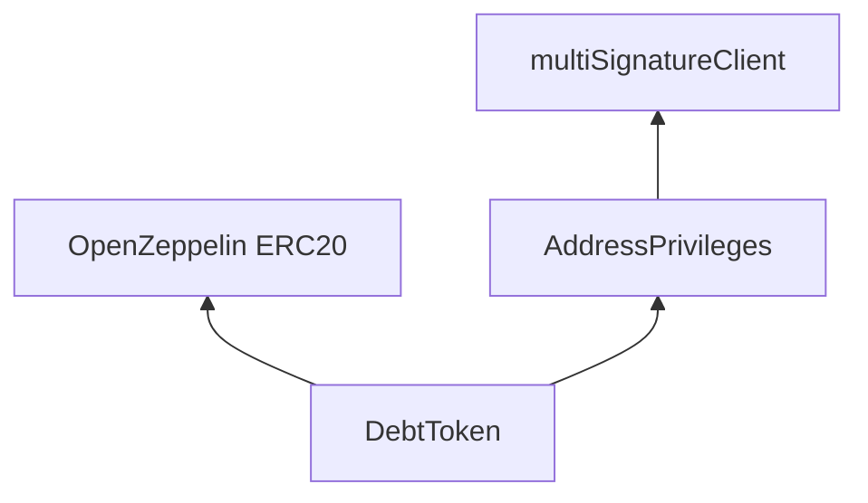
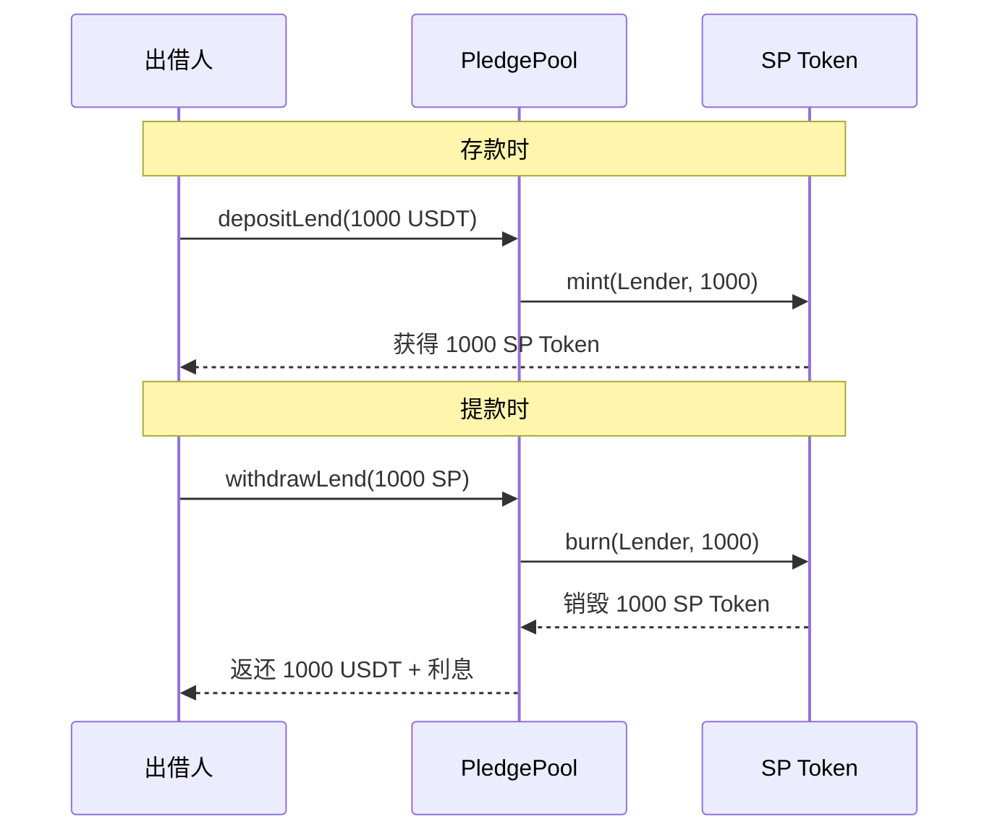
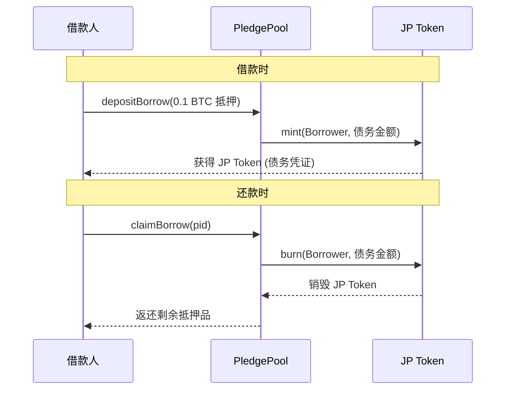
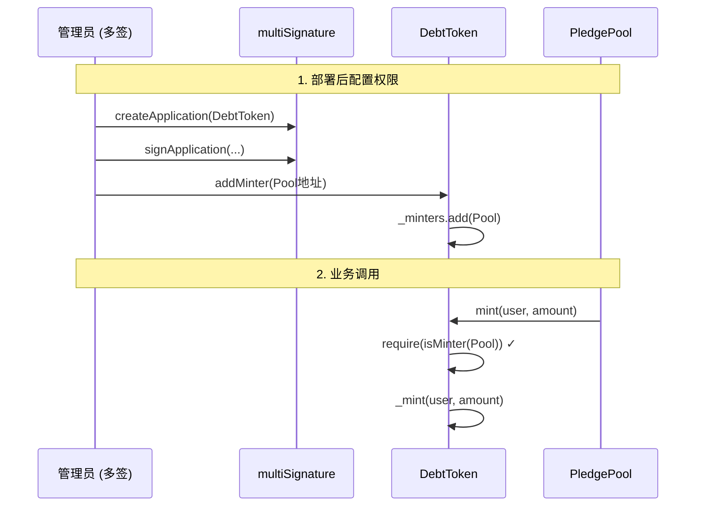

# DebtToken 债务代币合约详解

> DebtToken 是 Pledge V2 系统中用于代表用户权益或债务的 ERC20 代币。

---

## 合约概览

| 属性 | 值 |
|------|-----|
| 文件 | `contracts/pledge/DebtToken.sol` |
| 继承 | `ERC20`, `AddressPrivileges` |
| 作用 | 用户存款/借款的凭证代币 |
| 实例 | SP Token (出借人), JP Token (借款人) |

---

## 继承关系



---

## 在系统中的角色

### SP Token (Share Token) - 出借人凭证



### JP Token (Joint Token) - 借款人凭证



---

## 核心函数

### 1. constructor - 构造函数

```solidity
constructor(
    string memory _name,    // 代币名称 (如 "Pledge SP Token")
    string memory _symbol,  // 代币符号 (如 "SP")
    address multiSignature  // 多签合约地址
) public ERC20(_name, _symbol) AddressPrivileges(multiSignature) {}
```

**部署示例**:
```solidity
// 部署 SP Token
DebtToken spToken = new DebtToken("Pledge SP Token", "SP", multiSignAddress);

// 部署 JP Token  
DebtToken jpToken = new DebtToken("Pledge JP Token", "JP", multiSignAddress);
```

### 2. mint() - 铸造代币

```solidity
function mint(address _to, uint256 _amount) 
    public 
    onlyMinter  // 只有 Minter 才能调用
    returns (bool) 
{
    _mint(_to, _amount);  // 调用 ERC20 内部方法
    return true;
}
```

| 参数 | 说明 |
|------|------|
| `_to` | 接收代币的地址 |
| `_amount` | 铸造数量 |

**调用者**: 通常是 `PledgePool` 合约

### 3. burn() - 销毁代币

```solidity
function burn(address _from, uint256 _amount) 
    public 
    onlyMinter  // 只有 Minter 才能调用
    returns (bool) 
{
    _burn(_from, _amount);  // 调用 ERC20 内部方法
    return true;
}
```

| 参数 | 说明 |
|------|------|
| `_from` | 被销毁代币的持有者 |
| `_amount` | 销毁数量 |

---

## 权限控制

### onlyMinter 修饰符

继承自 `AddressPrivileges`:

```solidity
modifier onlyMinter() {
    require(isMinter(msg.sender), "Token: caller is not the minter");
    _;
}
```

### 权限分配流程



---

## ERC20 标准功能

DebtToken 继承了 OpenZeppelin ERC20 的所有标准功能:

| 函数 | 说明 |
|------|------|
| `transfer(to, amount)` | 转账 |
| `approve(spender, amount)` | 授权 |
| `transferFrom(from, to, amount)` | 授权转账 |
| `balanceOf(account)` | 查询余额 |
| `totalSupply()` | 总供应量 |
| `allowance(owner, spender)` | 查询授权额度 |

> [!NOTE]
> SP Token 和 JP Token 可以像普通 ERC20 一样转账，这意味着用户可以在二级市场交易他们的存款/借款凭证。

---

## 与 PledgePool 的交互

### 代码片段来自 PledgePool.sol

```solidity
// 结算时：铸造 SP Token 给出借人
function claimLend(uint256 _pid) external {
    // ...
    pool.spCoin.mint(msg.sender, spAmount);  // 铸造 SP Token
}

// 结算时：铸造 JP Token 给借款人
function claimBorrow(uint256 _pid) external {
    // ...
    pool.jpCoin.mint(msg.sender, jpAmount);  // 铸造 JP Token
}

// 提款时：销毁 SP Token
function withdrawLend(uint256 _pid, uint256 _spAmount) external {
    // ...
    pool.spCoin.burn(msg.sender, _spAmount);  // 销毁 SP Token
}
```

---

## 代币经济学

### SP Token 价值

```
SP Token 价值 = (池子总资金 + 利息) / SP Token 总供应量

例如:
- 池子总资金: 100,000 USDT
- 累计利息: 5,000 USDT
- SP Token 总量: 100,000 枚
- 每枚 SP Token = 105,000 / 100,000 = 1.05 USDT
```

### JP Token 价值

JP Token 代表债务，其"价值"是用户需要偿还的金额比例。

---

## 安全特性

| 特性 | 实现方式 |
|------|----------|
| 铸造权限控制 | `onlyMinter` 修饰符 |
| 多签保护 | `addMinter` 需要多签 |
| 标准实现 | 使用经过审计的 OpenZeppelin ERC20 |

---

## 总结

```
┌─────────────────────────────────────────────────────┐
│                    DebtToken                         │
│                                                      │
│  ERC20 标准接口                                      │
│  ├── transfer / approve / transferFrom              │
│  └── balanceOf / totalSupply / allowance            │
│                                                      │
│  自定义功能                                          │
│  ├── mint() ← 只有 PledgePool 可调用                │
│  └── burn() ← 只有 PledgePool 可调用                │
│                                                      │
│  实例                                                │
│  ├── SP Token: 出借人份额凭证                        │
│  └── JP Token: 借款人债务凭证                        │
└─────────────────────────────────────────────────────┘
```
