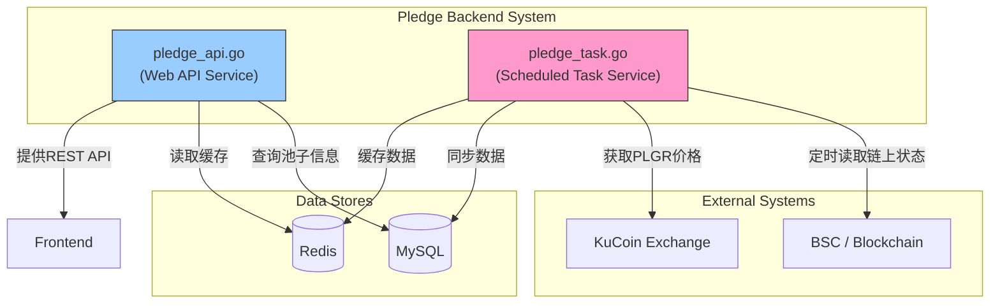
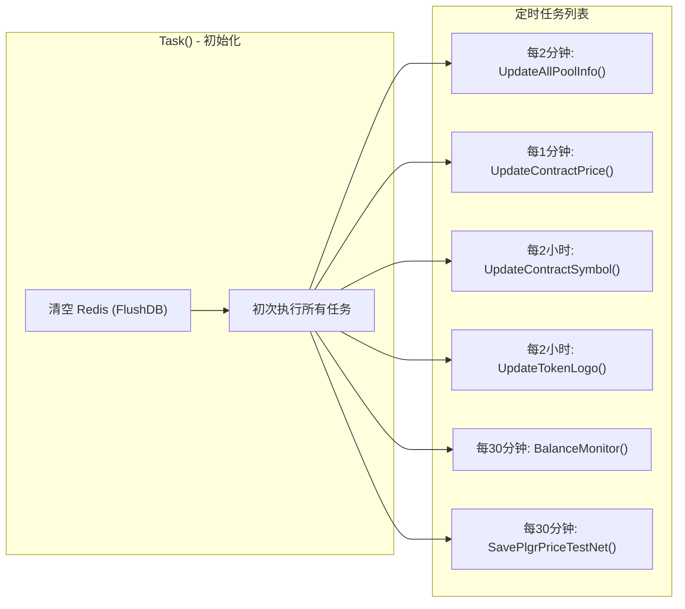
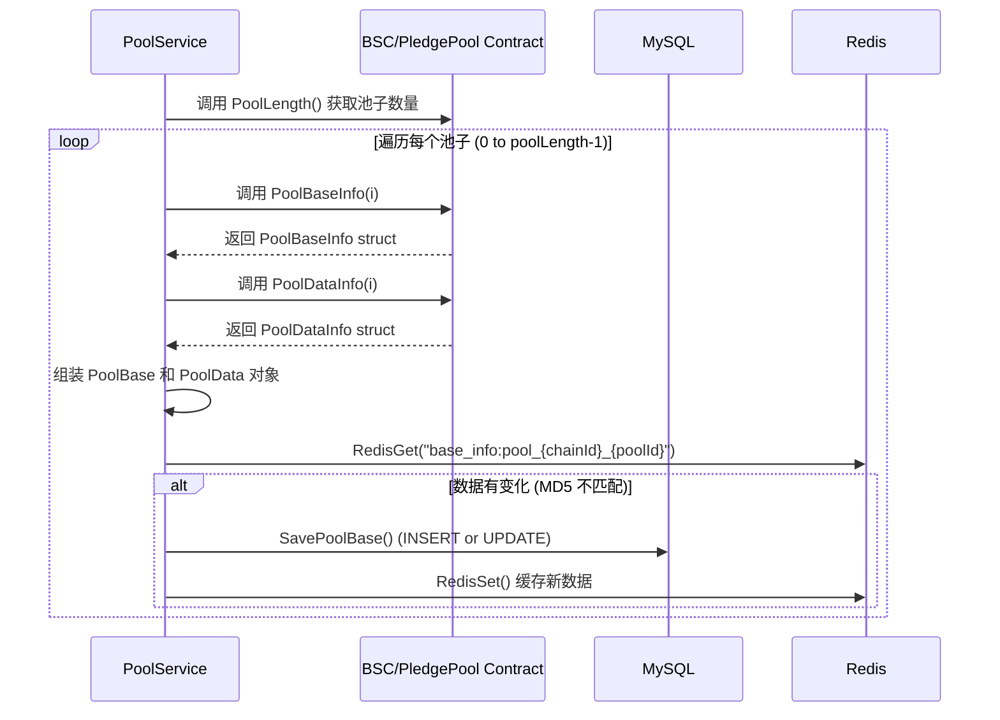
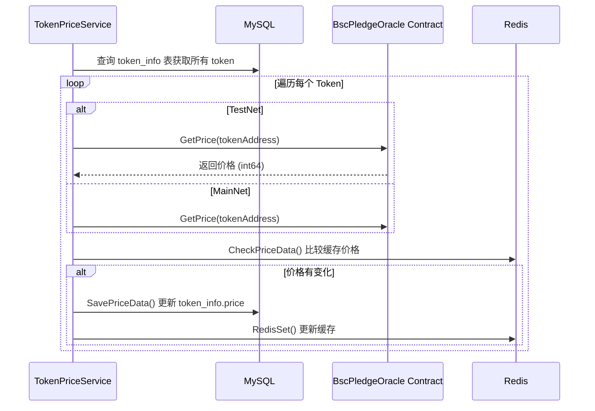
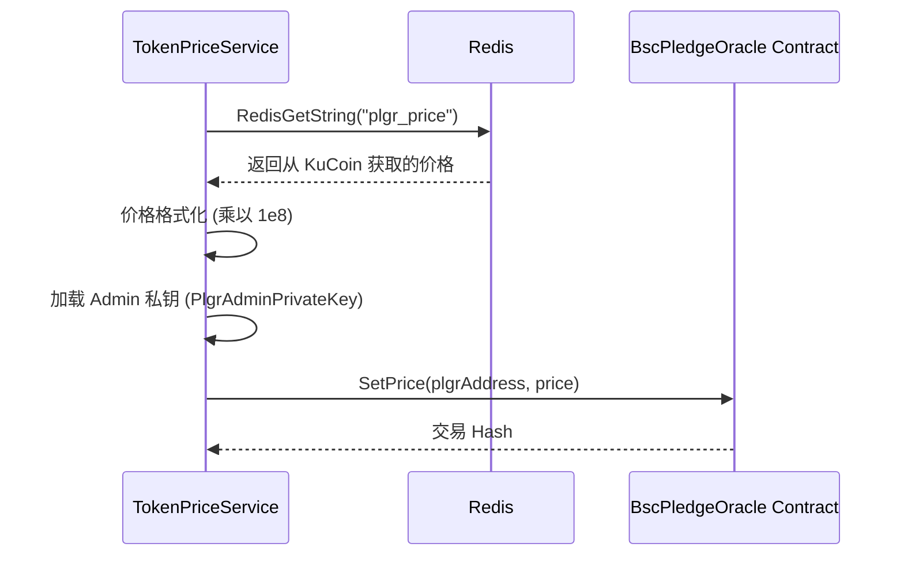
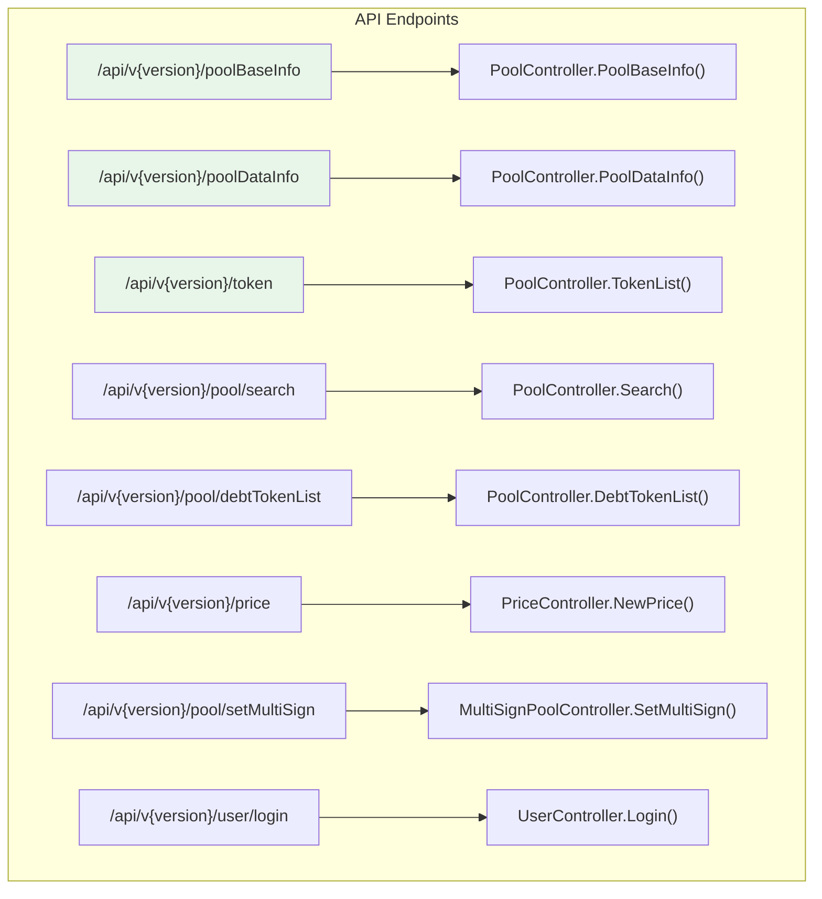
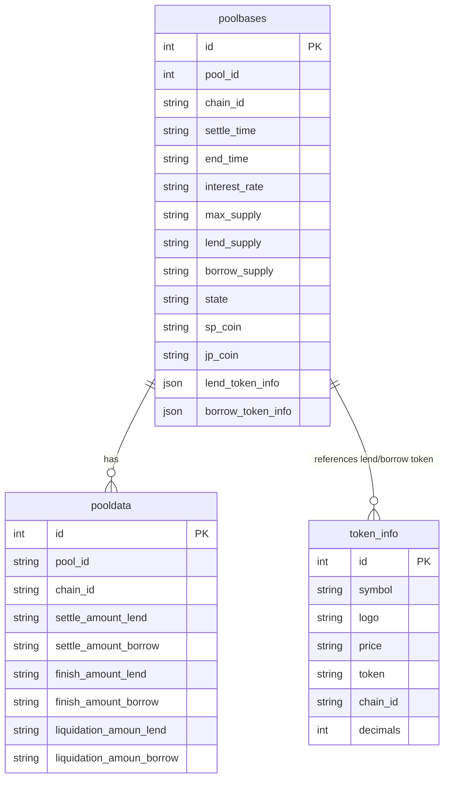
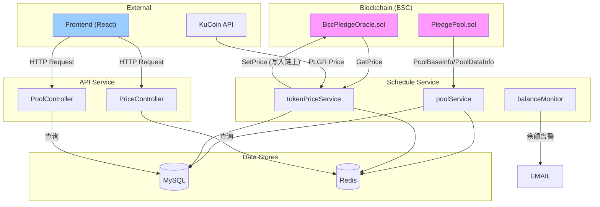

# Go 后端业务支持分析 (Go Backend Analysis)

> 本文档详细分析 `pledge-backend` 的 Go 代码架构，说明其如何与智能合约交互以及如何为前端提供数据支持。

---

## 系统架构总览 (System Architecture Overview)

`pledge-backend` 由两个独立运行的 Go 服务组成:



---

## 模块一: 定时任务 (`schedule` Module)

### 入口与定时调度

| 文件 | 功能 |
|------|------|
| `schedule/pledge_task.go` | 入口文件，初始化数据库连接 |
| `schedule/tasks/task.go` | 任务调度器，使用 `gocron` 库 |



### 核心服务详解

#### 1. `poolService.UpdateAllPoolInfo()`

**功能**: 从链上读取所有池子的最新状态，并同步到 MySQL 和 Redis。



> [!IMPORTANT]
> **关键点**: 后端通过调用合约的 `PoolBaseInfo` 和 `PoolDataInfo` 函数读取链上数据，这两个函数是 `PledgePool.sol` 中 `poolBaseInfo` 和 `poolDataInfo` 数组的公开 Getter。

#### 2. `tokenPriceService.UpdateContractPrice()`

**功能**: 从链上 Oracle 合约读取代币价格，并同步到 MySQL。



#### 3. `tokenPriceService.SavePlgrPrice()` (链上写操作)

**功能**: **写入** 链上 Oracle 合约，设置 PLGR 代币价格。**这是后端唯一向链上写入数据的操作。**



> [!CAUTION]
> **安全风险**: Admin 私钥直接硬编码在代码中 (`schedule/common/...`)。生产环境应使用 HSM 或 Secret Manager。

#### 4. `balanceMonitor.Monitor()`

**功能**: 监控 `PledgePoolToken` 合约地址的 BNB 余额，低于阈值时发送告警邮件。

---

## 模块二: API 服务 (`api` Module)

### 入口与路由

| 文件 | 功能 |
|------|------|
| `api/pledge_api.go` | API 服务入口 |
| `api/routes/route.go` | 路由定义 |



### 核心 API

#### `GET /poolBaseInfo?chainId={chainId}`

**功能**: 获取指定链上所有借贷池的基本信息。

**数据来源**: `poolbases` MySQL 表 (由 `schedule` 模块同步)。

**返回示例**:
```json
{
  "pool_id": 1,
  "chain_id": "97",
  "settle_time": "1642673987",
  "end_time": "1643472720",
  "interest_rate": "10000000",
  "state": "4",
  "lend_token_info": {"lendFee": "250000", "tokenName": "BUSD"},
  "borrow_token_info": {"borrowFee": "250000", "tokenName": "DAI"},
  "sp_coin": "0x...",
  "jp_coin": "0x..."
}
```

> [!TIP]
> `state` 字段对应 `PledgePool.sol` 中的 `PoolState` 枚举:
> - 0: MATCH (匹配中) | 1: EXECUTION (执行中) | 2: FINISH (已结束) | 3: LIQUIDATION (已清算) | 4: UNDONE (未完成)

---

## 数据库设计 (Database Schema)



---

## 数据流总结 (Data Flow Summary)



---

## 已完成的代码注释

以下文件已添加详细中文注释:

| 模块 | 文件 | 注释内容 |
|------|------|----------|
| Schedule | `task.go` | 任务调度流程 |
| Schedule | `poolService.go` | 链上数据同步逻辑 |
| Schedule | `tokenPriceService.go` | 价格读取 + 链上写入 |
| API | `pledge_api.go` | 服务启动流程 |
| API | `poolController.go` | API 接口说明 |
