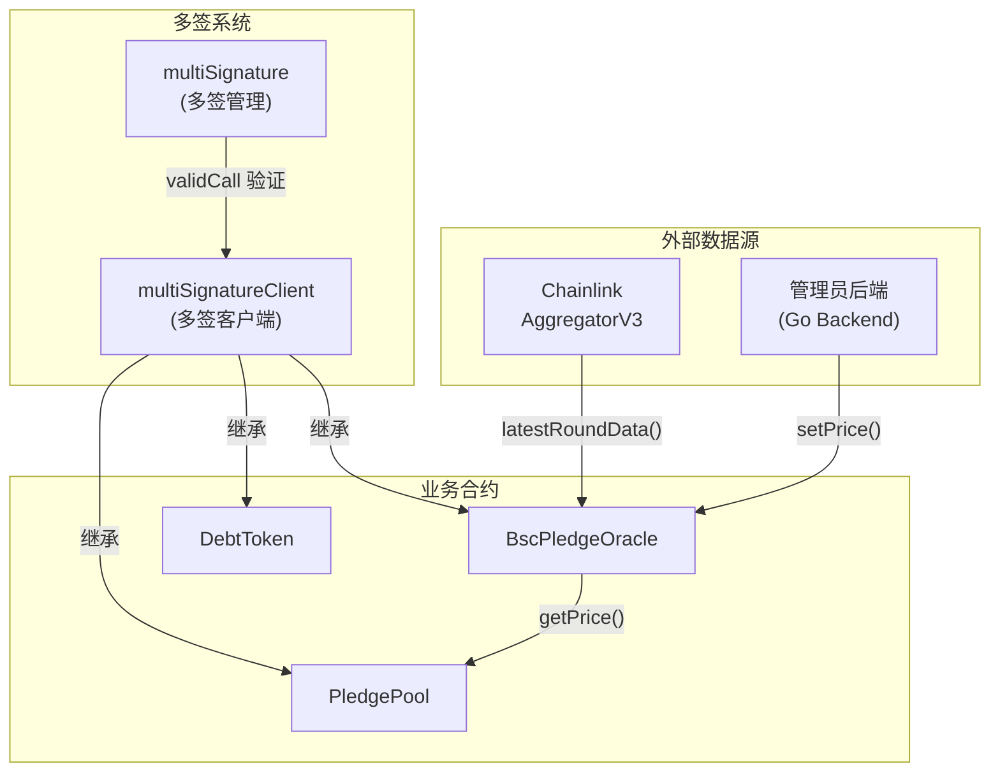
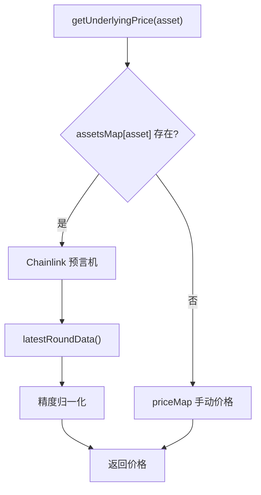
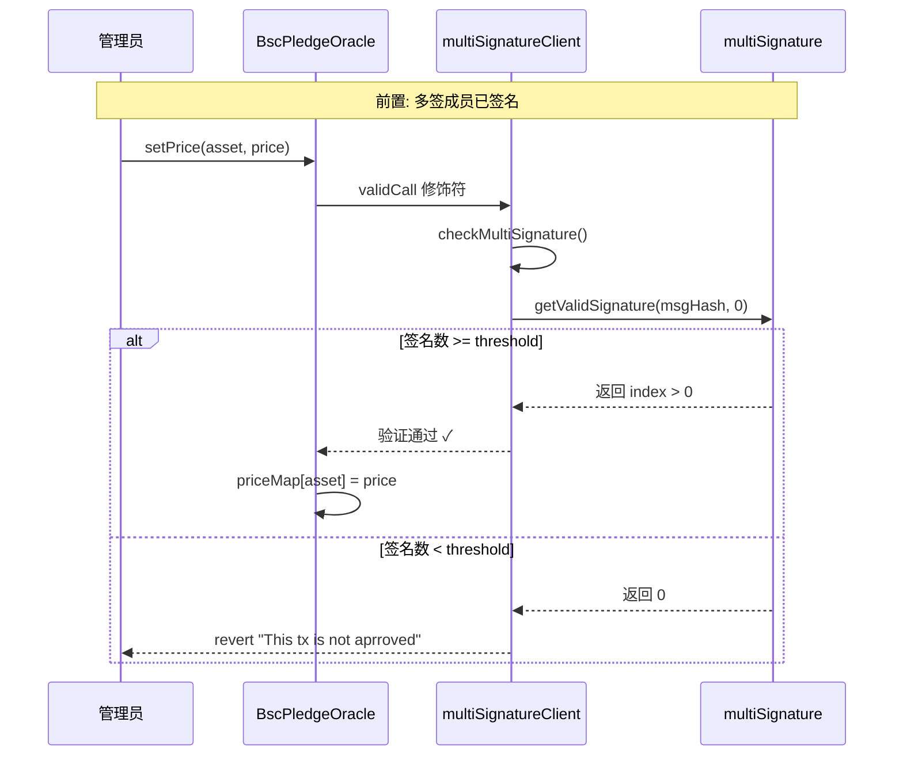
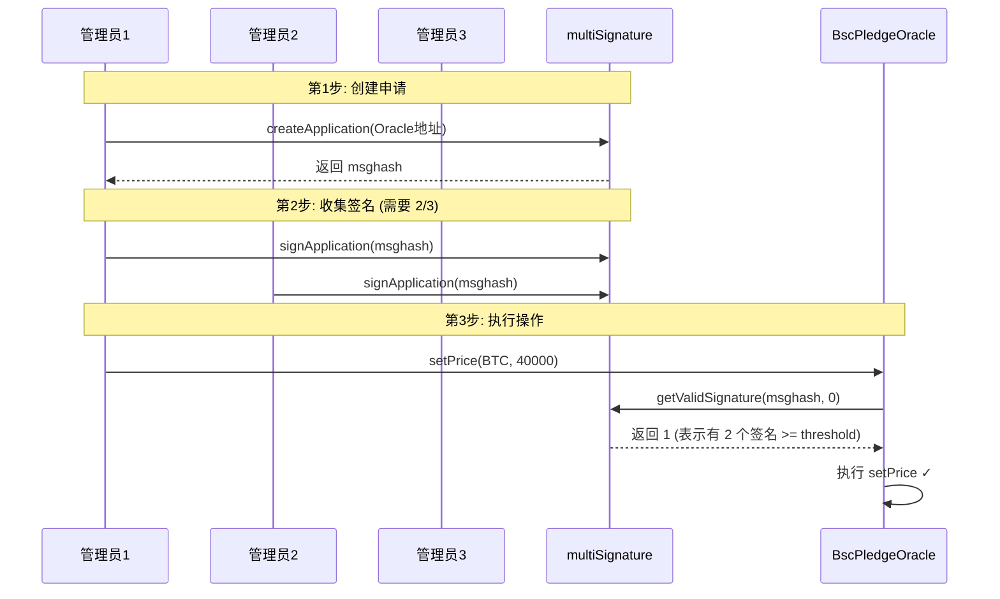

# Oracle 预言机与多签系统详解

> 本文档详细解析 Pledge V2 项目中的三个核心合约：
> - **BscPledgeOracle** - 价格预言机
> - **multiSignature** - 多签管理合约
> - **multiSignatureClient** - 多签客户端

---

## 系统架构概览



---

# 一、BscPledgeOracle (预言机合约)

## 合约概览

| 属性 | 值 |
|------|-----|
| 文件 | `contracts/pledge/BscPledgeOracle.sol` |
| 继承 | `multiSignatureClient` |
| 依赖 | Chainlink `AggregatorV3Interface` |
| 作用 | 为借贷池提供资产价格 |

## 核心功能

### 双数据源架构



### 状态变量

```solidity
// Chainlink 预言机地址映射
mapping(uint256 => AggregatorV3Interface) internal assetsMap;

// 资产精度映射 (Chainlink 返回的小数位)
mapping(uint256 => uint256) internal decimalsMap;

// 手动喂价映射 (管理员设置)
mapping(uint256 => uint256) internal priceMap;

// 全局精度除数
uint256 internal decimals = 1;
```

### 核心函数

#### 1. getUnderlyingPrice() - 获取价格

```solidity
function getUnderlyingPrice(uint256 underlying) public view returns (uint256) {
    AggregatorV3Interface assetsPrice = assetsMap[underlying];
    
    if (address(assetsPrice) != address(0)) {
        // 方式1: 从 Chainlink 获取
        (, int price, , , ) = assetsPrice.latestRoundData();
        // 精度归一化处理...
    } else {
        // 方式2: 使用手动设置的价格
        return priceMap[underlying];
    }
}
```

#### 2. setPrice() - 管理员喂价

```solidity
function setPrice(address asset, uint256 price) public validCall {
    priceMap[uint256(asset)] = price;
}
```

> [!IMPORTANT]
> `validCall` 修饰符表示需要多签授权才能设置价格。

#### 3. setAssetsAggregator() - 配置 Chainlink

```solidity
function setAssetsAggregator(
    address asset,
    address aggergator,
    uint256 _decimals
) public validCall {
    assetsMap[uint256(asset)] = AggregatorV3Interface(aggergator);
    decimalsMap[uint256(asset)] = _decimals;
}
```

### 精度处理逻辑

```
Chainlink 返回价格可能是:
- BTC/USD: 8位小数 (如 4000000000000 = $40,000.00)
- ETH/USD: 8位小数
- 其他...

系统需要将其统一为 18 位精度:
- 如果 tokenDecimals < 18: price * 10^(18-tokenDecimals)
- 如果 tokenDecimals > 18: price / 10^(tokenDecimals-18)
- 如果 tokenDecimals = 18: price
```

---

# 二、multiSignatureClient (多签客户端)

## 合约概览

| 属性 | 值 |
|------|-----|
| 文件 | `contracts/multiSignature/multiSignatureClient.sol` |
| 作用 | 为业务合约提供多签验证能力 |
| 继承者 | `PledgePool`, `BscPledgeOracle`, `DebtToken` 等 |

## 核心机制

### 存储方式

使用 **Assembly 直接操作存储槽** (而非普通状态变量):

```solidity
// 存储位置 = keccak256("org.multiSignature.storage")
uint256 private constant multiSignaturePositon = uint256(keccak256("org.multiSignature.storage"));

// 读取存储
function getValue(uint256 position) internal view returns (uint256 value) {
    assembly {
        value := sload(position)
    }
}

// 写入存储
function saveValue(uint256 position, uint256 value) internal {
    assembly {
        sstore(position, value)
    }
}
```

> [!NOTE]
> **为什么用 Assembly?**
> - 避免与继承合约的存储冲突
> - 更灵活的存储管理
> - Gas 优化

### validCall 修饰符

```solidity
modifier validCall() {
    checkMultiSignature();
    _;
}

function checkMultiSignature() internal view {
    // 1. 计算消息哈希 = hash(调用者地址, 目标合约地址)
    bytes32 msgHash = keccak256(abi.encodePacked(msg.sender, address(this)));
    
    // 2. 获取多签合约地址
    address multiSign = getMultiSignatureAddress();
    
    // 3. 查询是否有足够的签名
    uint256 newIndex = IMultiSignature(multiSign).getValidSignature(msgHash, defaultIndex);
    
    // 4. 如果没有足够签名，revert
    require(newIndex > defaultIndex, "multiSignatureClient : This tx is not aprroved");
}
```

### 验证流程图



---

# 三、multiSignature (多签管理合约)

## 合约概览

| 属性 | 值 |
|------|-----|
| 文件 | `contracts/multiSignature/multiSignature.sol` |
| 作用 | 管理多签成员和签名 |
| 继承 | `multiSignatureClient` (自己也是客户端) |

## 状态变量

```solidity
// 所有签名者地址列表
address[] public signatureOwners;

// 签名阈值 (需要多少人签名才能通过)
uint256 public threshold;

// 签名信息结构
struct signatureInfo {
    address applicant;      // 申请人
    address[] signatures;   // 已签名的地址列表
}

// 消息哈希 => 签名信息数组
mapping(bytes32 => signatureInfo[]) public signatureMap;
```

## 核心函数

### 1. constructor - 初始化

```solidity
constructor(address[] memory owners, uint256 limitedSignNum) {
    require(owners.length >= limitedSignNum);
    signatureOwners = owners;   // 设置签名者列表
    threshold = limitedSignNum; // 设置阈值
}

// 例如: 3 个 owner, threshold = 2 (3选2多签)
```

### 2. createApplication() - 创建签名申请

```solidity
function createApplication(address to) external returns(uint256) {
    // 计算消息哈希
    bytes32 msghash = getApplicationHash(msg.sender, to);
    
    // 创建新的签名申请
    signatureMap[msghash].push(signatureInfo(msg.sender, new address[](0)));
    
    emit CreateApplication(msg.sender, to, msghash);
    return index;
}
```

### 3. signApplication() - 签名

```solidity
function signApplication(bytes32 msghash) external onlyOwner {
    // 将自己添加到签名列表
    signatureMap[msghash][defaultIndex].signatures.addWhiteListAddress(msg.sender);
    
    emit SignApplication(msg.sender, msghash, defaultIndex);
}
```

### 4. getValidSignature() - 验证签名是否足够

```solidity
function getValidSignature(bytes32 msghash, uint256 lastIndex) 
    external view returns(uint256) 
{
    signatureInfo[] storage info = signatureMap[msghash];
    
    for (uint256 i = lastIndex; i < info.length; i++) {
        // 如果签名数达到阈值，返回 index+1 (表示有效)
        if (info[i].signatures.length >= threshold) {
            return i + 1;
        }
    }
    return 0; // 无有效签名
}
```

## 完整多签流程



---

## 辅助库: whiteListAddress

用于管理地址白名单的库:

```solidity
library whiteListAddress {
    // 添加地址 (防重复)
    function addWhiteListAddress(address[] storage whiteList, address temp) internal;
    
    // 删除地址
    function removeWhiteListAddress(address[] storage whiteList, address temp) internal;
    
    // 检查地址是否存在
    function isEligibleAddress(address[] memory whiteList, address temp) internal pure returns (bool);
}
```

---

## 安全考量

### 1. 预言机风险

> [!CAUTION]
> 如果预言机价格被操纵，整个借贷系统都会受影响:
> - **价格被压低** → 正常仓位被错误清算
> - **价格被拉高** → 可以超额借款

**缓解措施**:
- 使用 Chainlink 去中心化预言机
- 管理员喂价需要多签授权
- 可以配置多个数据源

### 2. 多签安全

| 风险 | 缓解措施 |
|------|----------|
| 私钥泄露 | 使用硬件钱包 |
| 共谋攻击 | 选择可信的签名者 |
| 单点故障 | 设置合理的 threshold |

### 3. 签名重放

当前实现使用 `defaultIndex = 0`，每次验证第一个签名申请。如果需要防止重放，应该更新 index。

---

## 总结

```
┌─────────────────────────────────────────────────────────────┐
│                     多签授权系统                              │
│                                                              │
│  multiSignature (核心)                                       │
│  ├── 管理签名者列表                                          │
│  ├── 管理签名阈值                                            │
│  └── 验证签名                                                │
│                                                              │
│  multiSignatureClient (基类)                                 │
│  └── validCall 修饰符 → 所有敏感操作的守门员                   │
│                                                              │
│  业务合约                                                    │
│  ├── BscPledgeOracle (setPrice 需要多签)                     │
│  ├── PledgePool (createPool 需要多签)                        │
│  └── DebtToken (addMinter 需要多签)                          │
└─────────────────────────────────────────────────────────────┘
```
