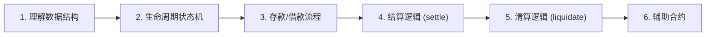
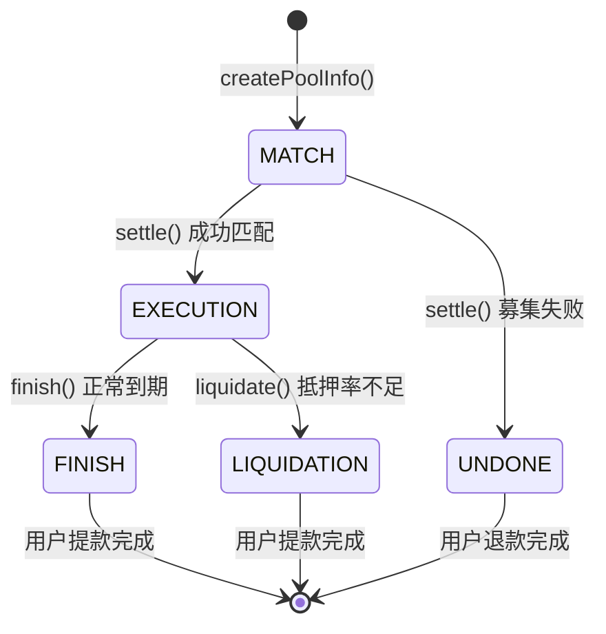
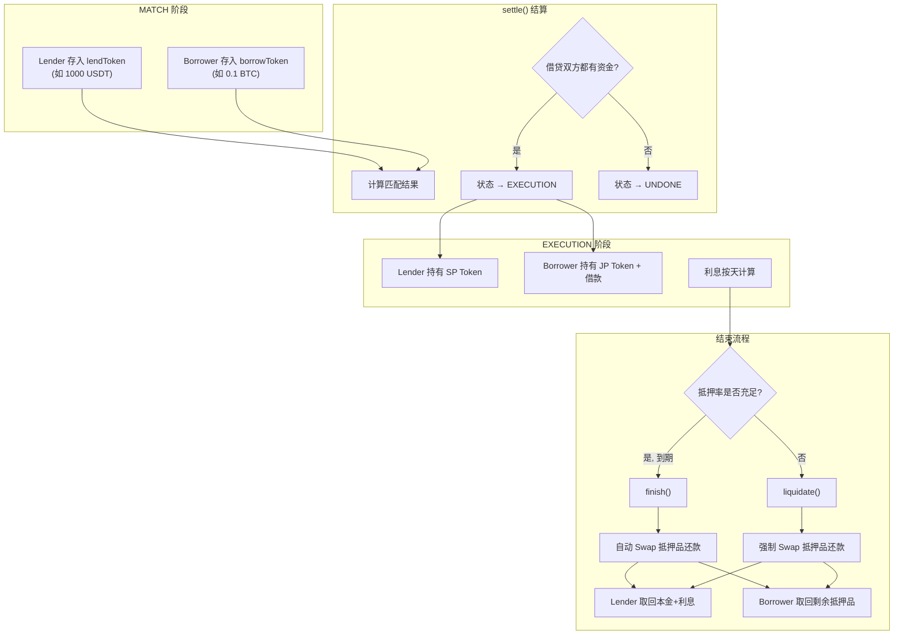
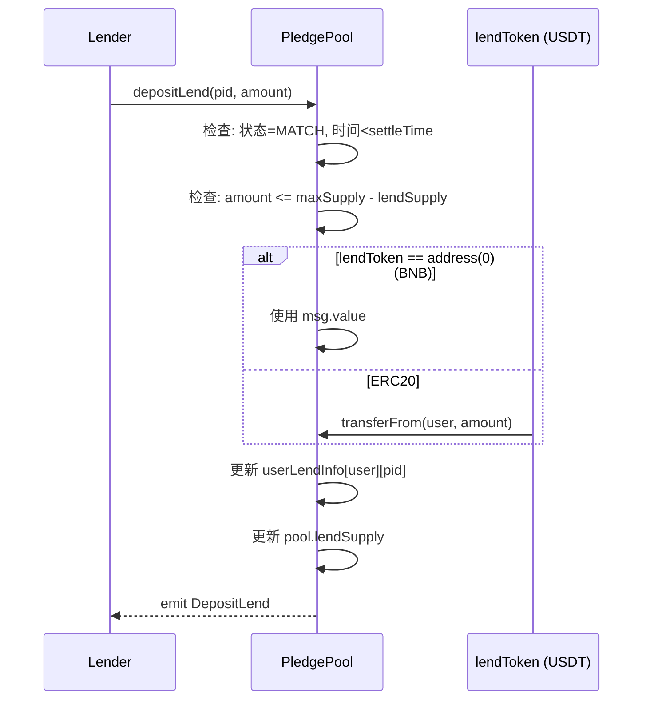
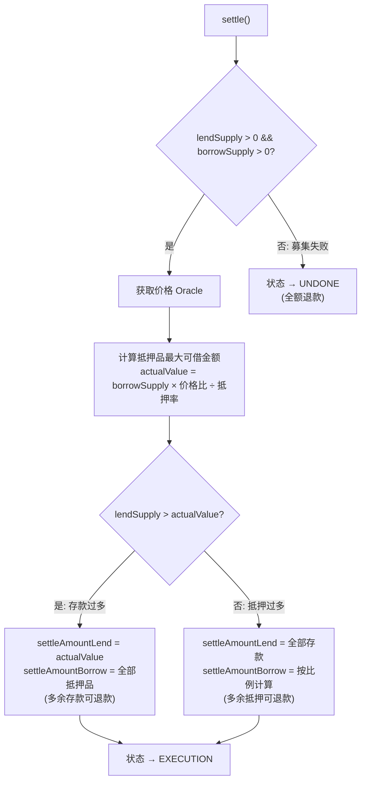
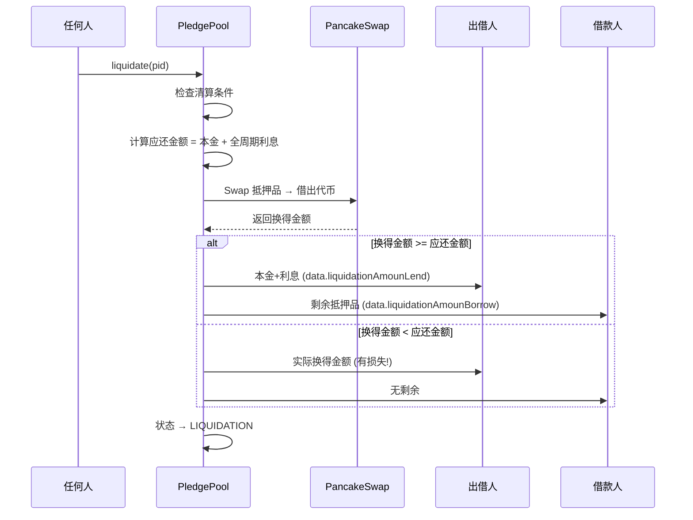
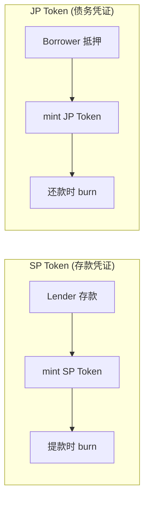
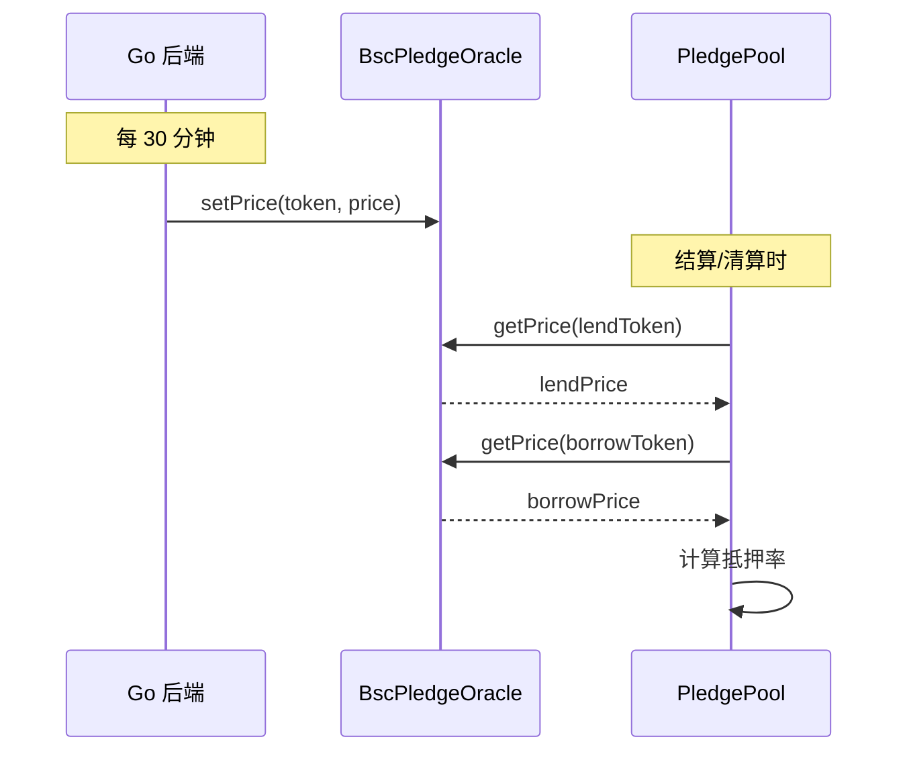

# PledgePool 智能合约深度解析 (Core Contract Study Guide)

> 本文档是 Pledge V2 核心合约 `PledgePool.sol` 的学习指南，帮助你掌握资金流向和核心业务逻辑。

---

## 学习路径建议



---

## 第一步：理解核心数据结构

### 池子状态枚举 (PoolState)

```solidity
enum PoolState {
    MATCH,       // 0: 匹配阶段 - 允许存款/抵押
    EXECUTION,   // 1: 执行阶段 - 已结算，正在计息
    FINISH,      // 2: 完成阶段 - 正常到期，可提款
    LIQUIDATION, // 3: 清算阶段 - 抵押品价值不足，强制清算
    UNDONE       // 4: 未完成阶段 - 募集失败，全额退款
}
```

### 状态转换图



### 池子基础信息 (PoolBaseInfo)

```solidity
struct PoolBaseInfo {
    uint256 settleTime;      // 结算时间 (募集截止)
    uint256 endTime;         // 结束时间 (贷款到期)
    uint256 interestRate;    // 固定年化利率 (1e8 精度, 如 5000000 = 5%)
    uint256 maxSupply;       // 最大募集限额
    uint256 lendSupply;      // 当前存款总额
    uint256 borrowSupply;    // 当前抵押总额
    uint256 martgageRate;    // 抵押率 (1e8 精度, 如 200000000 = 200%)
    address lendToken;       // 借出代币 (如 USDT)
    address borrowToken;     // 抵押代币 (如 BTC)
    PoolState state;         // 当前状态
    IDebtToken spCoin;       // SP Token (出借人凭证)
    IDebtToken jpCoin;       // JP Token (借款人债务凭证)
    uint256 autoLiquidateThreshold; // 清算阈值
}
```

### 用户信息结构

```solidity
// 出借人信息
struct LendInfo {
    uint256 stakeAmount;  // 存入金额
    uint256 refundAmount; // 退款金额
    bool hasNoRefund;     // 已退款标志
    bool hasNoClaim;      // 已领取 SP Token 标志
}

// 借款人信息  
struct BorrowInfo {
    uint256 stakeAmount;  // 抵押品数量
    uint256 refundAmount; // 退款金额
    bool hasNoRefund;     // 已退款标志
    bool hasNoClaim;      // 已领取借款标志
}
```

---

## 第二步：资金流向全景图



---

## 第三步：核心函数详解

### 1. depositLend() - 出借人存款

**文件位置**: `PledgePool.sol:352`



**关键代码解析**:
```solidity
function depositLend(uint256 _pid, uint256 _stakeAmount) 
    external payable 
    nonReentrant      // 防重入
    notPause          // 未暂停
    timeBefore(_pid)  // 时间 < settleTime
    stateMatch(_pid)  // 状态 = MATCH
{
    // 边界检查: 不能超过最大募集额
    require(_stakeAmount <= (pool.maxSupply).sub(pool.lendSupply));
    
    // 处理转账 (ETH vs ERC20)
    uint256 amount = getPayableAmount(pool.lendToken, _stakeAmount);
    require(amount > minAmount);  // 最小金额限制
    
    // 更新状态
    lendInfo.stakeAmount = lendInfo.stakeAmount.add(amount);
    pool.lendSupply = pool.lendSupply.add(amount);
}
```

### 2. depositBorrow() - 借款人抵押

**文件位置**: `PledgePool.sol:522`

与 `depositLend` 类似，但存入的是抵押品:
```solidity
function depositBorrow(uint256 _pid, uint256 _stakeAmount)
    external payable
    nonReentrant notPause timeBefore(_pid) stateMatch(_pid)
{
    // 处理抵押品转账
    uint256 amount = getPayableAmount(pool.borrowToken, _stakeAmount);
    
    // 更新状态
    borrowInfo.stakeAmount = borrowInfo.stakeAmount.add(amount);
    pool.borrowSupply = pool.borrowSupply.add(amount);
}
```

### 3. settle() - 结算 (核心!)

**文件位置**: `PledgePool.sol:660`

**功能**: 将池子从 MATCH 状态转为 EXECUTION 或 UNDONE



**核心公式**:
```solidity
// 【关键公式1】计算抵押品能支撑的最大借款金额
// actualValue = (抵押品数量 × 抵押品价格) ÷ (借出代币价格 × 抵押率)
uint256 actualValue = pool.borrowSupply
    .mul(prices[1].mul(calDecimal).div(prices[0]))  // 价格比
    .div(pool.martgageRate);                         // 除以抵押率

// 举例: 0.1 BTC (价格 40000 USDT), 抵押率 200%
// actualValue = 0.1 × 40000 / 2 = 2000 USDT (最多能借 2000 USDT)
```

### 4. liquidate() - 清算 (DeFi 核心!)

**文件位置**: `PledgePool.sol:831`

**触发条件** (`checkoutLiquidate`):
```solidity
// 【清算公式】
// 抵押品当前市值 < 借款本金 × (1 + 清算阈值)

uint256 borrowValueNow = settleAmountBorrow × (borrowPrice / lendPrice);
uint256 valueThreshold = settleAmountLend × (1 + autoLiquidateThreshold);

return borrowValueNow < valueThreshold;

// 举例: 借了 2000 USDT, 清算阈值 10%
// - valueThreshold = 2000 × 1.1 = 2200 USDT
// - 如果抵押品价值跌到 2100 USDT，触发清算!
```

**清算流程**:


### 5. finish() - 正常结束

**文件位置**: `PledgePool.sol:748`

与 `liquidate` 类似，但触发条件是 `block.timestamp > endTime`

**利息计算公式**:
```solidity
// 时间比率 = (endTime - settleTime) / 365天
uint256 timeRatio = ((pool.endTime.sub(pool.settleTime)).mul(baseDecimal)).div(baseYear);

// 利息 = 本金 × 利率 × 时间比率
uint256 interest = timeRatio.mul(pool.interestRate.mul(data.settleAmountLend)).div(1e16);

// 举例: 本金 10000 USDT, 利率 5%, 周期 30 天
// timeRatio = 30/365 ≈ 0.082
// interest = 10000 × 0.05 × 0.082 = 41 USDT
```

---

## 第四步：辅助合约解析

### DebtToken.sol (债务凭证)

**功能**: ERC20 扩展，代表用户在池子中的份额



**关键方法**:
```solidity
// 只有 PledgePool 合约可以调用
function mint(address account, uint256 amount) external onlyMinter;
function burn(address account, uint256 amount) external onlyMinter;
```

### BscPledgeOracle.sol (预言机)

**功能**: 提供代币价格，用于计算抵押率



> [!CAUTION]
> **Oracle 安全风险**: 如果喂价被操纵，可能导致:
> - 虚假清算 (价格被压低)
> - 超额借款 (价格被拉高)

---

## 第五步：实战学习建议

### 1. 代码阅读顺序

```
1. PoolState 枚举 (L24-36)
2. PoolBaseInfo 结构体 (L52-66)
3. depositLend() (L352-382)
4. depositBorrow() (L522-543)
5. settle() (L660-726)
6. checkoutLiquidate() (L808-823)
7. liquidate() (L831-872)
8. finish() (L748-799)
```

### 2. 关键问题清单

在阅读代码时，尝试回答以下问题:

| 问题 | 代码位置 |
|------|----------|
| 最小存款金额是多少? | L20: `minAmount = 100e18` |
| 利率精度是多少? | L17-18: `calDecimal=1e18`, `baseDecimal=1e8` |
| 什么情况下进入 UNDONE? | L718-724: 任一方未参与 |
| 清算时利息怎么算? | L844: 按全周期计算 |
| Swap 失败会怎样? | L778: `require(amountIn >= lendAmount)` 会 revert |

### 3. 调试技巧

```solidity
// 在测试网可以通过这些 view 函数验证状态:
function getPoolState(uint256 _pid) public view returns (uint256);
function checkoutSettle(uint256 _pid) external view returns (bool);
function checkoutFinish(uint256 _pid) public view returns (bool);
function checkoutLiquidate(uint256 _pid) external view returns (bool);
function getUnderlyingPriceView(uint256 _pid) public view returns (uint256[2] memory);
```

---

## 附录：关键公式汇总

| 公式名称 | 公式 | 精度 |
|----------|------|------|
| 抵押品最大借款额 | `borrowSupply × (borrowPrice/lendPrice) ÷ martgageRate` | 1e18 |
| 时间比率 | `(endTime - settleTime) ÷ 365天` | 1e8 |
| 利息 | `本金 × 利率 × 时间比率 ÷ 1e16` | -- |
| 清算阈值 | `借款本金 × (1 + autoLiquidateThreshold)` | 1e8 |
| 用户份额 | `用户存款 × 1e18 ÷ 总存款` | 1e18 |
