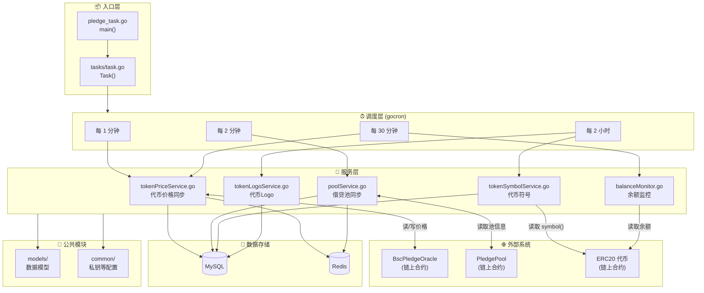
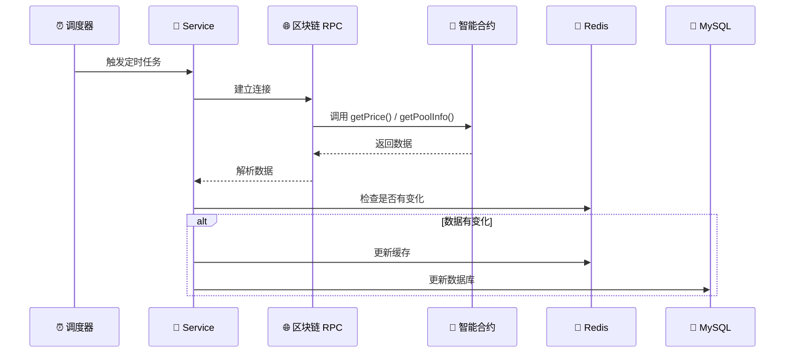
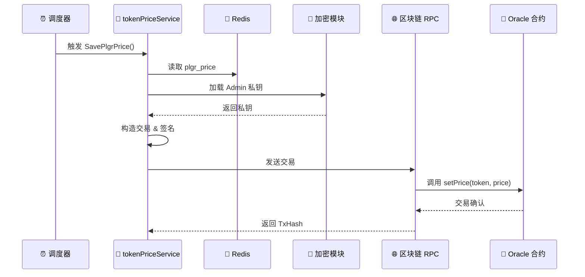
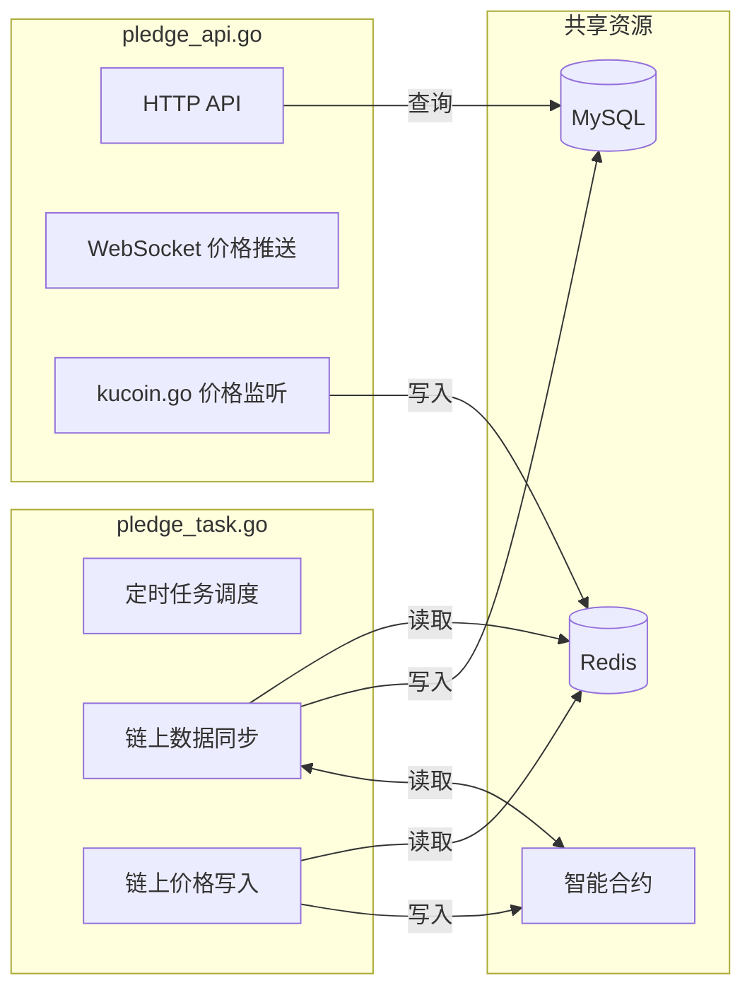

# Schedule 模块架构

## 概述

`schedule` 模块是 Pledge 后端的**定时任务服务**，与 `pledge_api.go` 分开独立运行。
负责定期从区块链同步数据到数据库，以及将价格数据写入链上 Oracle。

---

## 整体架构图



---

## 目录结构

```
schedule/
├── pledge_task.go          # 入口文件，初始化并启动任务
├── README.md               # 使用说明
├── pledge-task.service     # Linux systemd 服务配置
│
├── tasks/
│   └── task.go             # 任务调度器，定义所有定时任务
│
├── services/               # 核心业务逻辑
│   ├── tokenPriceService.go    # ⭐ 代币价格同步（含链上写操作）
│   ├── poolService.go          # 借贷池信息同步
│   ├── tokenSymbolService.go   # 代币符号同步
│   ├── tokenLogoService.go     # 代币Logo同步
│   └── balanceMonitor.go       # 余额监控告警
│
├── models/                 # 数据模型
│   └── ...                 # TokenInfo, PoolInfo 等
│
└── common/                 # 公共配置
    └── ...                 # Admin 私钥等
```

---

## 定时任务清单

```mermaid
gantt
    title 定时任务执行频率
    dateFormat X
    axisFormat %s

    section 高频任务
    UpdateContractPrice (读取价格)    :active, 0, 60
    UpdateAllPoolInfo (同步池信息)   :active, 0, 120

    section 中频任务
    Monitor (余额监控)               :active, 0, 1800
    SavePlgrPrice (写入价格)         :active, 0, 1800

    section 低频任务
    UpdateContractSymbol (代币符号)  :active, 0, 7200
    UpdateTokenLogo (代币Logo)       :active, 0, 7200
```



| 任务 | 频率 | 服务 | 功能 |
|------|------|------|------|
| `UpdateContractPrice()` | 每 1 分钟 | tokenPriceService | 从 Oracle 读取代币价格 |
| `UpdateAllPoolInfo()` | 每 2 分钟 | poolService | 从 PledgePool 读取借贷池数据 |
| `Monitor()` | 每 30 分钟 | balanceMonitor | 监控账户余额，低于阈值发邮件 |
| `SavePlgrPriceTestNet()` | 每 30 分钟 | tokenPriceService | ⭐ 写入 PLGR 价格到 Oracle |
| `UpdateContractSymbol()` | 每 2 小时 | tokenSymbolService | 读取代币 symbol() |
| `UpdateTokenLogo()` | 每 2 小时 | tokenLogoService | 获取代币 Logo URL |

---

## 数据流向

### 读取流程（链上 → 数据库）



### 写入流程（数据库 → 链上）



---

## 与 API 服务的关系



**关键点**：
- API 服务的 `kucoin.go` 将 KuCoin 价格写入 Redis
- Schedule 服务的 `SavePlgrPrice()` 从 Redis 读取价格，写入链上 Oracle
- 两个服务通过 **Redis** 和 **MySQL** 共享数据

---

## 启动方式

```bash
# 开发环境
go run schedule/pledge_task.go

# 生产环境 (Linux systemd)
sudo systemctl start pledge-task.service
```
