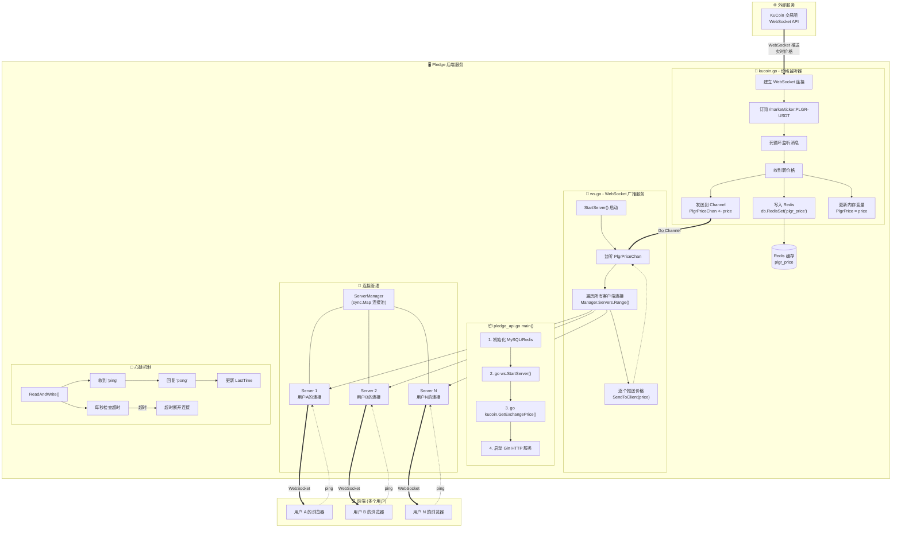

# WebSocket 实时价格推送系统架构

## 概述

这是一个核心的 WebSocket 服务模块，主要用于 **向前端实时推送 PLGR 代币价格**。

核心作用：**打通"交易所 -> 后端 -> 前端"的实时数据链路。**

当 `kucoin.go` 监听到新价格时，会通过 Go Channel 发给 `ws.go` 模块，然后该模块会把新价格广播给所有连接的客户端（前端网页）。

---

## 架构流程图



---

## 核心模块详解

### 1. 价格监听器 (`kucoin.go`)

**文件路径**: `pledge-backend/api/models/kucoin/kucoin.go`

**职责**:
- 通过 WebSocket 连接 KuCoin 交易所
- 订阅 `PLGR-USDT` 交易对的实时行情
- 将价格同步到三个地方：
  1. Redis 缓存 (`plgr_price`)
  2. Go Channel (`PlgrPriceChan`)
  3. 内存变量 (`PlgrPrice`)

**关键代码**:
```go
// 订阅 PLGR-USDT 行情
ch := kucoin.NewSubscribeMessage("/market/ticker:PLGR-USDT", false)

// 收到新价格时的处理
case msg := <-mc:
    t := &kucoin.TickerLevel1Model{}
    msg.ReadData(t)
    PlgrPriceChan <- t.Price           // 发送到 Channel
    PlgrPrice = t.Price                 // 更新内存
    db.RedisSetString("plgr_price", PlgrPrice, 0)  // 写入 Redis
```

---

### 2. WebSocket 广播服务 (`ws.go`)

**文件路径**: `pledge-backend/api/models/ws/ws.go`

**职责**:
- 管理所有前端 WebSocket 连接
- 监听价格 Channel，广播给所有客户端
- 实现心跳保活机制

#### 核心结构体

| 结构体 | 作用 |
|--------|------|
| `Server` | 单个客户端连接，包含 Socket、发送通道、最后心跳时间 |
| `ServerManager` | 连接池，使用 `sync.Map` 存储所有在线连接 |
| `Message` | WebSocket 消息格式 `{code, data}` |

#### 关键函数

**`StartServer()`** - 价格广播核心
```go
func StartServer() {
    for {
        select {
        case price, ok := <-kucoin.PlgrPriceChan:
            if ok {
                // 遍历所有连接，逐个推送
                Manager.Servers.Range(func(key, value interface{}) bool {
                    value.(*Server).SendToClient(price, SuccessCode)
                    return true
                })
            }
        }
    }
}
```

**`ReadAndWrite()`** - 心跳机制
```go
// 收到 ping 时回复 pong
if string(message) == "ping" {
    s.LastTime = time.Now().Unix()
    s.SendToClient("pong", PongCode)
}

// 每秒检查是否超时
if time.Now().Unix()-s.LastTime >= UserPingPongDurTime {
    s.SendToClient("heartbeat timeout", ErrorCode)
    return  // 断开连接
}
```

---

## 数据流向总结

| 步骤 | 组件 | 动作 |
|------|------|------|
| 1 | KuCoin 交易所 | 产生 PLGR/USDT 实时价格 |
| 2 | `kucoin.go` | 接收价格 → 写入 Redis + Channel |
| 3 | `ws.go` | 从 Channel 读取 → 广播给所有客户端 |
| 4 | 前端浏览器 | 接收 WebSocket 消息 → 更新 UI |

---

## 启动流程

在 `pledge_api.go` 的 `main()` 函数中：

```go
func main() {
    db.InitMysql()
    db.InitRedis()
    
    go ws.StartServer()           // 启动 WebSocket 广播服务
    go kucoin.GetExchangePrice()  // 启动价格监听器
    
    app := gin.Default()
    // ... 配置路由
    app.Run(":" + config.Config.Env.Port)
}
```

---

## 关键代码位置索引

| 功能 | 文件 | 行号 |
|------|------|------|
| 发送价格到 Channel | `kucoin.go` | L75 |
| 从 Channel 读取价格 | `ws.go` | L121 |
| 广播给所有客户端 | `ws.go` | L123-126 |
| 心跳超时检测 | `ws.go` | L103-114 |
| 启动协程 | `pledge_api.go` | L70-75 |

---

## 潜在问题提醒

1. **断线不会自动重连**: `kucoin.go` 中如果 WebSocket 连接断开，函数会直接 `return` 退出，价格同步停止。
2. **Channel 可能阻塞**: `PlgrPriceChan` 缓冲区只有 2，如果没有消费者，第 3 次更新会阻塞。
