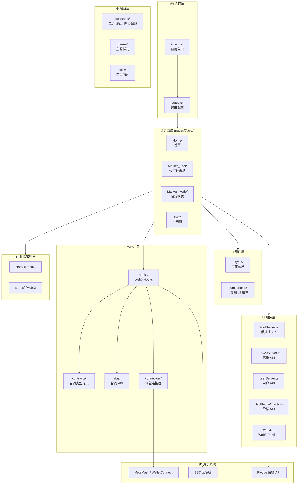
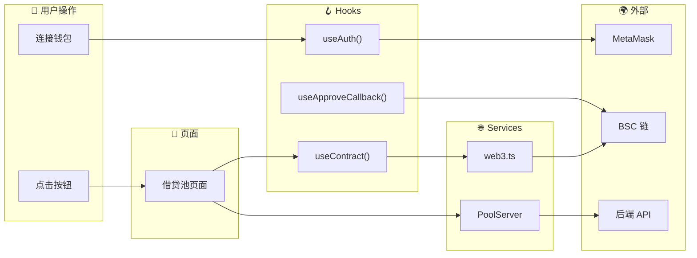
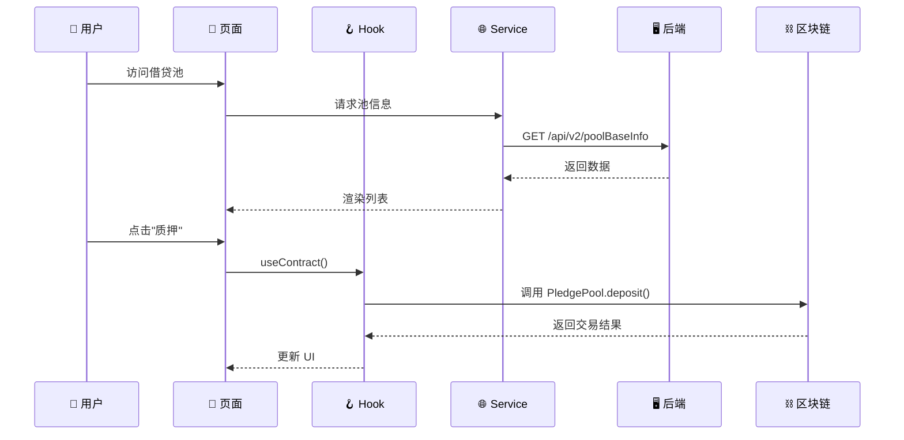
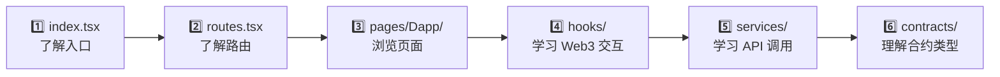

# Pledge 前端架构

## 整体架构图



---

## 目录结构详解

```
src/
├── index.tsx              # 应用入口，挂载 React App
├── routes.tsx             # 顶层路由配置
│
├── pages/                 # 页面组件
│   └── Dapp/              # DApp 主页面
│       ├── Home/          # 首页
│       ├── Market_Pool/   # 借贷池市场
│       ├── Market_Mode/   # 借贷模式选择
│       ├── Dex/           # 交易所功能
│       └── routes.tsx     # DApp 内部路由
│
├── components/            # 可复用 UI 组件 (108个)
├── Layout/                # 页面布局组件 (Header, Footer, Sidebar)
│
├── contracts/             # 智能合约 TypeScript 类型
│   ├── PledgePool.ts      # 质押池合约
│   ├── ERC20.ts           # ERC20 代币
│   ├── BscPledgeOracle.ts # 价格预言机
│   ├── DebtToken.ts       # 债务代币
│   └── ...
│
├── abis/                  # 合约 ABI 文件 (10个)
│
├── hooks/                 # 自定义 React Hooks (29个)
│   ├── useContract.ts     # 获取合约实例
│   ├── useAuth.ts         # 钱包认证
│   ├── useApproveCallback.ts  # 代币授权
│   ├── useCurrencyBalance.ts  # 余额查询
│   ├── useSwapCallback.ts     # 交易回调
│   └── ...
│
├── services/              # API 服务层 (8个)
│   ├── PoolServer.ts      # 借贷池后端 API
│   ├── ERC20Server.ts     # 代币服务
│   ├── BscPledgeOracle.ts # 预言机服务
│   ├── web3.ts            # Web3 Provider
│   └── ...
│
├── state/                 # Redux 状态管理 (44个文件)
├── stores/                # MobX 状态管理
│
├── connectors/            # 钱包连接器
│   └── (MetaMask, WalletConnect 配置)
│
├── constants/             # 常量配置 (19个)
│   ├── 合约地址
│   ├── 网络配置
│   └── 代币列表
│
├── utils/                 # 工具函数 (21个)
├── theme/                 # 主题样式
└── assets/                # 静态资源
```

---

## 核心模块关系



---

## 数据流向



---

## 关键 Hooks 说明

| Hook | 文件 | 功能 |
|------|------|------|
| `useContract` | hooks/useContract.ts | 获取智能合约实例 |
| `useAuth` | hooks/useAuth.ts | 钱包连接/断开 |
| `useApproveCallback` | hooks/useApproveCallback.ts | 代币授权操作 |
| `useCurrencyBalance` | hooks/useCurrencyBalance.ts | 查询代币余额 |
| `useSwapCallback` | hooks/useSwapCallback.ts | 代币交换 |

---

## 关键 Services 说明

| Service | 文件 | 功能 |
|---------|------|------|
| `PoolServer` | services/PoolServer.ts | 借贷池 CRUD 操作 |
| `ERC20Server` | services/ERC20Server.ts | 代币信息查询 |
| `web3` | services/web3.ts | Web3 Provider 管理 |
| `BscPledgeOracle` | services/BscPledgeOracle.ts | 价格预言机交互 |

---

## 学习路径建议


