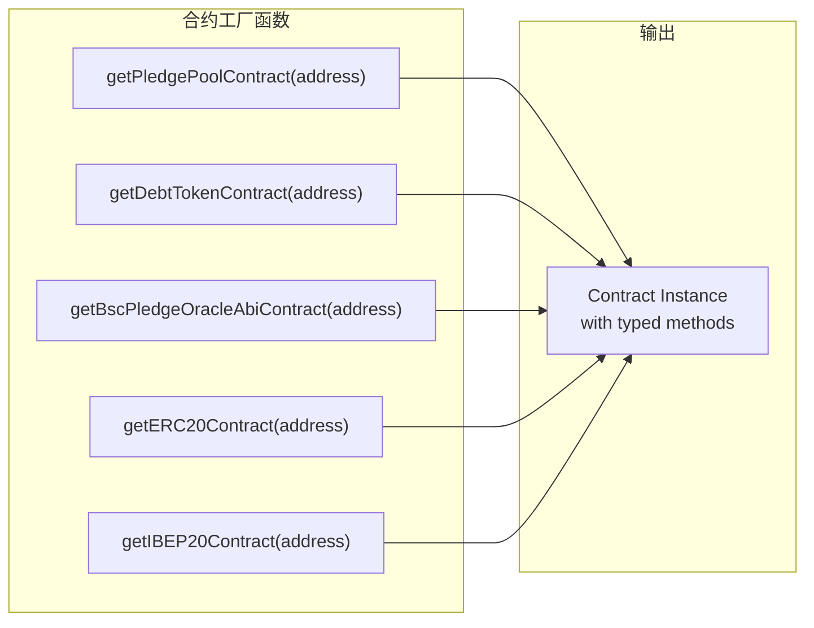
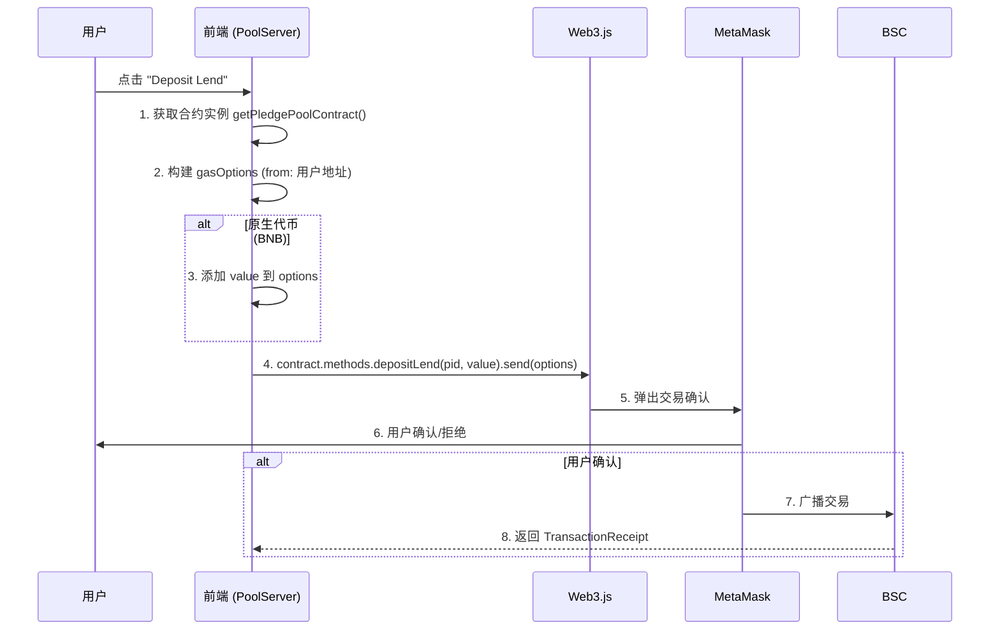
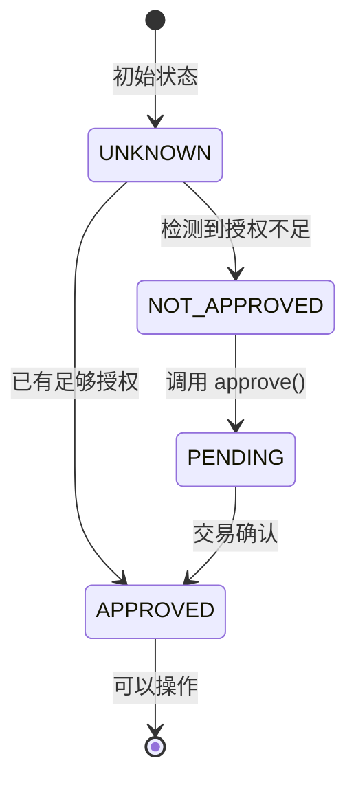
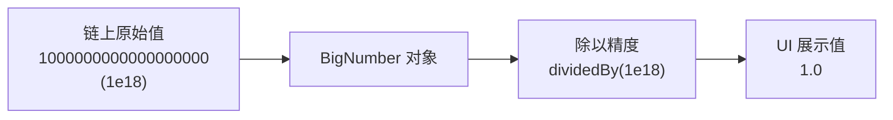
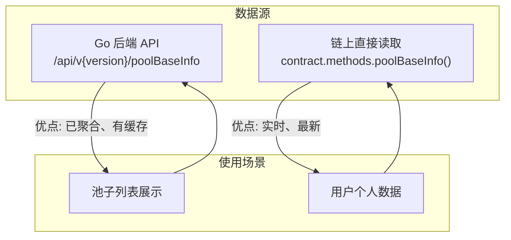
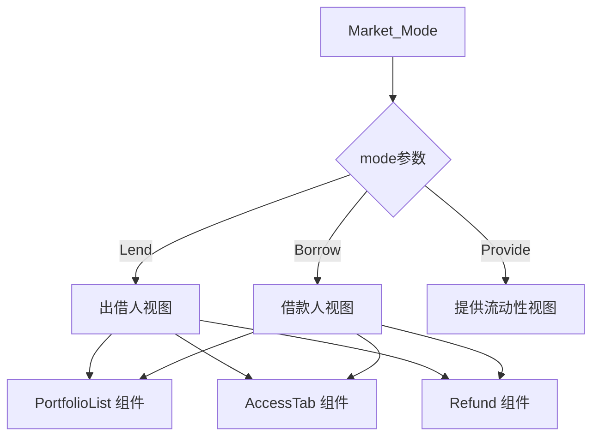
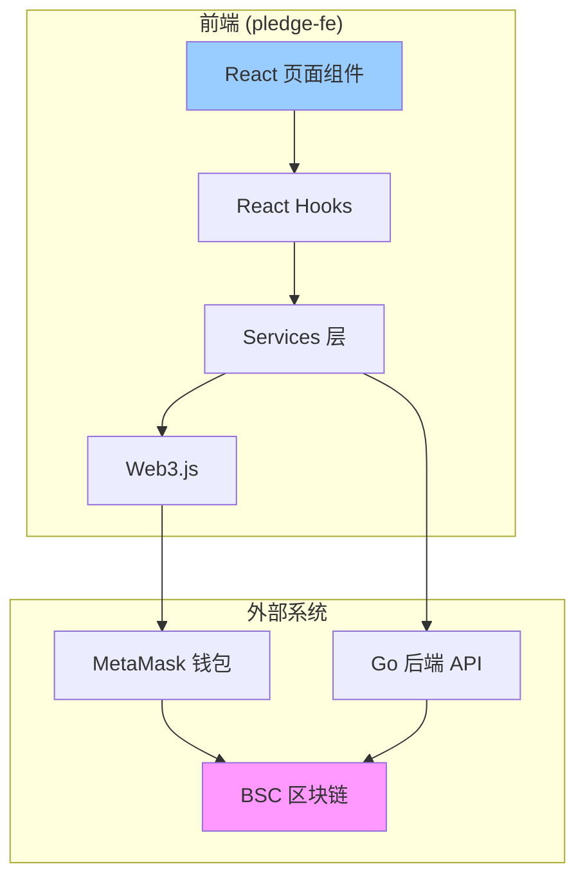

# 前端架构分析 (Frontend Architecture Analysis)

> 本文档详细分析 `pledge-fe` React + TypeScript 前端代码，说明其如何与智能合约交互、构建交易以及处理链上数据。

---

## 技术栈概览

| 技术 | 用途 |
|------|------|
| React 17 | UI 框架 |
| TypeScript | 类型安全 |
| Web3.js | 区块链交互 |
| bignumber.js | 大数精度处理 |
| Ant Design | UI 组件库 |
| react-router-dom | 路由管理 |

---

## 项目结构

```
pledge-fe/src/
├── abis/              # 智能合约 ABI 文件 (JSON)
├── contracts/         # ABI 自动生成的 TypeScript 类型
├── services/          # 业务逻辑层 (Web3 + API)
│   ├── web3.ts        # Web3 实例和合约工厂
│   ├── PoolServer.ts  # PledgePool 合约交互
│   ├── userServer.ts  # 后端 API 调用
│   └── ERC20Server.ts # ERC20 代币交互
├── hooks/             # React Hooks
│   ├── useApproveCallback.ts  # 代币授权逻辑
│   └── useActiveWeb3React.ts  # 钱包连接状态
├── pages/Dapp/        # 主要页面组件
│   ├── Home/          # 首页
│   ├── Market_Mode/   # 借贷市场 (Lend/Borrow)
│   └── Market_Pool/   # 池子详情
├── state/             # Redux 状态管理
└── utils/             # 工具函数 (BigNumber 处理等)
```

---

## 核心模块分析

### 1. 合约交互层 (`services/web3.ts`)

**功能**: 创建 Web3 合约实例，提供类型安全的合约调用接口。



**关键代码**:
```typescript
// 创建 Web3 实例 (使用浏览器注入的 Provider，如 MetaMask)
const web3 = new Web3(Web3.givenProvider);

// 创建 PledgePool 合约实例
const getPledgePoolContract = (address: string) => {
  return new web3.eth.Contract(PledgePoolAbi, address) as {
    methods: PledgePool;  // TypeScript 类型
  };
};
```

---

### 2. 交易构建 (`services/PoolServer.ts`)

**功能**: 封装所有与 PledgePool 合约的交互，构建并发送交易。

#### 交易方法映射

| 前端方法 | 合约函数 | 类型 | 说明 |
|----------|----------|------|------|
| `depositLend(pid, value)` | `depositLend` | 写入 | 出借人存款 |
| `depositBorrow(pid, value)` | `depositBorrow` | 写入 | 借款人存入抵押品 |
| `getclaimLend(pid)` | `claimLend` | 写入 | 出借人提取本金+利息 |
| `getclaimBorrow(pid)` | `claimBorrow` | 写入 | 借款人提取剩余抵押品 |
| `getwithdrawLend(pid, value)` | `withdrawLend` | 写入 | 出借人部分提款 |
| `getwithdrawBorrow(pid, value)` | `withdrawBorrow` | 写入 | 借款人部分提款 |
| `getrefundLend(pid)` | `refundLend` | 写入 | 出借人退款 (UNDONE 状态) |
| `getrefundBorrow(pid)` | `refundBorrow` | 写入 | 借款人退款 (UNDONE 状态) |
| `getemergencyLendWithdrawal(pid)` | `emergencyLendWithdrawal` | 写入 | 紧急提款 (出借人) |
| `getemergencyBorrowWithdrawal(pid)` | `emergencyBorrowWithdrawal` | 写入 | 紧急提款 (借款人) |
| `poolLength()` | `poolLength` | 读取 | 获取池子数量 |
| `getPoolBaseData()` | `poolBaseInfo` | 读取 | 获取池子基础信息 |
| `getuserLendInfo(pid)` | `userLendInfo` | 读取 | 获取用户出借信息 |
| `getuserBorrowInfo(pid)` | `userBorrowInfo` | 读取 | 获取用户借款信息 |

#### 交易构建流程



**关键代码**:
```typescript
async depositLend(pid, value, coinAddress, chainId) {
  // 1. 根据 chainId 获取正确的合约地址
  const contract = getPledgePoolContract(
    chainId == 97 ? pledge_address : pledge_mainaddress
  );
  
  // 2. 构建交易选项 (from: 当前用户地址)
  let options = await gasOptions();
  
  // 3. 如果是原生代币 (BNB)，需要添加 value
  if (coinAddress === '0x0000000000000000000000000000000000000000') {
    options = { ...options, value };
  }
  
  // 4. 调用合约方法并发送交易
  return await contract.methods.depositLend(pid, value).send(options);
}
```

---

### 3. 代币授权流程 (`hooks/useApproveCallback.ts`)

**功能**: 管理 ERC20 代币的 approve 授权状态和操作。



**授权状态枚举**:
```typescript
export enum ApprovalState {
  UNKNOWN,      // 未知 (正在查询)
  NOT_APPROVED, // 未授权 (需要 approve)
  PENDING,      // 授权中 (等待交易确认)
  APPROVED,     // 已授权 (可以操作)
}
```

---

### 4. BigNumber 处理 (`utils/util.ts`)

**问题**: 以太坊返回的数值都是 `uint256`，JavaScript 原生 Number 无法精确表示超过 2^53 的整数。

**解决方案**: 使用 `bignumber.js` 库进行精确计算。



**常用转换函数**:
```typescript
// 18 位精度转换 (大多数 ERC20 代币)
const dealNumber_18 = (num) => {
  let x = new BigNumber(num);
  let y = new BigNumber(1e18);
  return x.dividedBy(y).toString();
};

// 6 位精度转换 (如 USDT)
const dealNumber_6 = (num) => {
  let x = new BigNumber(num);
  let y = new BigNumber(1e6);
  return x.dividedBy(y).toString();
};

// 利率/比率转换 (1e8 精度)
const dealNumber_8 = (num) => {
  let x = new BigNumber(num);
  let y = new BigNumber(1e6);
  return x.dividedBy(y).toString();
};
```

---

### 5. 数据获取策略

前端同时使用两种数据源:



| 数据类型 | 数据源 | 理由 |
|----------|--------|------|
| 池子列表、价格 | 后端 API | 已聚合处理，减少 RPC 调用 |
| 用户个人信息 | 链上直接读取 | 需要实时数据 |
| 交易操作 | 直接调用合约 | 必须通过链上执行 |

---

### 6. 页面组件 (`pages/Dapp/Market_Mode`)

**功能**: 借贷市场主页面 (Lend / Borrow / Provide 三种模式)



**核心数据流**:
```typescript
// 1. 从后端获取池子基础信息
const datainfo = await services.userServer.getpoolBaseInfo(chainId);

// 2. 从链上获取用户个人信息
const lendInfo = await services.PoolServer.getuserLendInfo(pid, chainId);
const borrowInfo = await services.PoolServer.getuserBorrowInfo(pid, chainId);

// 3. 处理 BigNumber，转换为可展示的数值
const maxSupply = dealNumber_18(item.pool_data.maxSupply);
const interestRate = dealNumber_8(item.pool_data.interestRate);
```

---

## TypeScript 类型系统

前端使用 `ethereum-abi-types-generator` 自动从 ABI 生成 TypeScript 类型:

```typescript
// 自动生成的 PledgePool 接口 (contracts/PledgePool.ts)
export interface PledgePool {
  depositLend(_pid: string, _stakeAmount: string): MethodPayableReturnContext;
  depositBorrow(_pid: string, _stakeAmount: string): MethodPayableReturnContext;
  claimLend(_pid: string): MethodReturnContext;
  claimBorrow(_pid: string): MethodReturnContext;
  poolBaseInfo(parameter0: string): MethodConstantReturnContext<PoolBaseInfoResponse>;
  // ... 35+ 方法
}
```

这确保了:
1. **编译时类型检查**: 调用不存在的方法会报错
2. **自动补全**: IDE 可以提示可用的方法和参数类型
3. **参数类型安全**: 传入错误类型的参数会报错

---

## 前端与合约交互总结



---

## 关键发现

1. **双数据源策略**: 
   - 列表数据通过后端 API 获取 (已缓存/聚合)
   - 用户个人数据直接从链上读取 (实时性)

2. **BigNumber 处理模式**:
   - 所有链上数值都使用 `bignumber.js` 处理
   - 统一的精度转换函数 (`dealNumber_18`, `dealNumber_8`)

3. **类型安全**:
   - ABI 自动生成 TypeScript 类型
   - 合约方法调用有完整的类型检查

4. **网络切换支持**:
   - 同时支持测试网 (chainId=97) 和主网 (chainId=56)
   - 动态选择合约地址
